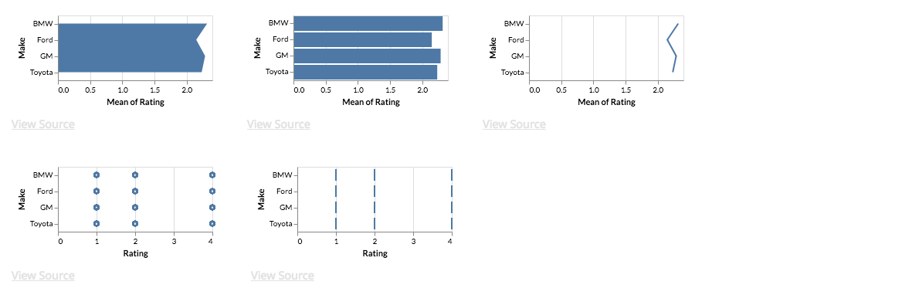
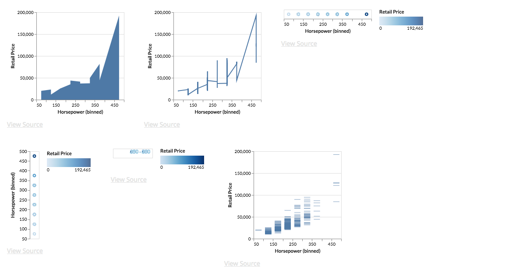
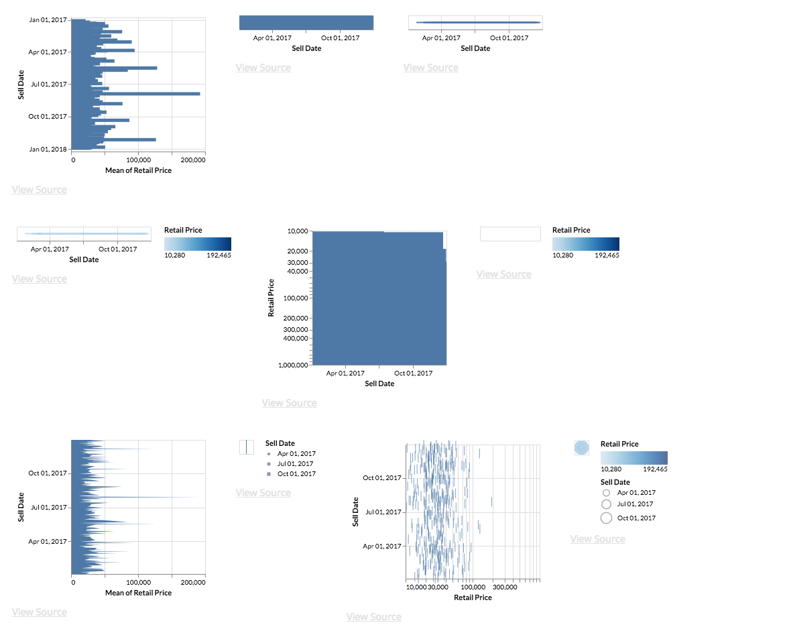

# Data Generation

The files in this repository are intended to generate groups of visualization for pair-wise comparison. Note, **this is a work-in-progress**.

## Tools

### Generation Tools

You can run generation by using `run.py`. It accepts an interaction, number of groups per interaction, and an output directory as optional command-line arguments. For example, to generate a series of files (1 file per interaction) in the data directory, each with 20 groups, run:

```python run.py --interaction all --groups 20 --output_dir ../../data/to_label```

### Dataset Viewer

To view the generated data, start a the Draco Tools server (`yarn start` from `/draco-tools`) and navigate to the `Dataset Viewer`. You view the various interactions, divided into pages by the number of dimensions in the visualizations. Note, this tool is barebones, as it is used internally for development at the moment.

### Labeler

Getting this to function initially is a little involved.

1. In `/draco/learn/data_util.py`, comment out lines 281-283 and uncomment lines 286-288. Then run it.
2. Remove `/draco-tools/server/label_data.db` if it exists.
3. Run `/draco-tools/server/db_util.py`.
4. Start the server by running `/draco-tools/server/labeler.py`.
5. You should be good to go! Start the Draco Tools server (`yarn start` from `/draco-tools`) and navigate to the Labeler.

The page displays two visualizations, their specs, and the data used. Use the mouse or arrow keys to classify a >, <, =, or both bad relationship between the two.

## Approach

### Probabilistic Specification Generation

We define a probabilistic model for generation of individual specifications, roughly modeled after the distribution of visualizations we expect in the real-world. This allows us to generate a wide breadth of visualization specifications via probabilistic sampling, approximating the true distribution without the requirement of matching the enourmous space. There are two key ideas in the definition of this model.

1. For each property of a Vega-Lite specification (i.e. each JSON key, nested or not), we define a probability for that property appearing in the specification. For example, `mark` may have a probability of 1, as it is a required property. Meanwhile, `stack` may have a probability of 0.1, as it is relatively uncommon in the real-world.
2. For each value of a Vega-Lite specification (i.e. each JSON value, nested or not), we define a probability for that value appearing, conditioned on its property appearing. For example, a `center` value for `stack` may have a 0.1 probability, meaning that if `stack` is a property chosen by the model, we have a 0.1 chance of producing a `center` stacked visualization. The sum of the probabilities of each value conditioned on its parent property is constrained to 1 to preserve a valid distribution (though the code does not actually need this enforced to function properly).

### Group Generation

**Groups** are a set of visualizations within which each individual will be pair-wise compared (better, worse, even) with each other individual in the group. It follows that a group with *n* visualizations will have *n* choose 2 pairs. We generate numerous groups for each of the parameters (e.g. each interaction, each field set) for the approaches described below, in order to increase diversity of specifications.

We have thus far considered two approaches to group generation. In both approaches, all visualizations in a group have the same number of dimensions and fields visualized.

1. Interaction based generation. This is the approach currently in `master`.
2. Data based generation. This approach can be found in the branch `data_based_gen` (note that this was thrown together rather quickly by modifying the code for the approach described above, and so generation code nor UI are particularly clean or easy to understand. In the dataset viewer here, files are by number of dimensions, and the dimension selector is irrelevant).

#### 1. Interaction-Based Generation

Here, visualizations within a group differ on the basis of a pre-defined set of *interactions*. *Interactions* take the form of a set of specification properties. For example, visualizations in a group generated for the `mark` interaction will vary in the mark specified, while visualizations in a `mark-channel` group will vary by either mark, channel, or both. Our current approach is to guarantee enumeration over all property values for a given interaction (thus a group for `mark` will attempt to cover all mark types).

In this approach, each group starts off as a single probabilistically generated **base specification**. This base specification is then modified according to the rules described above, and each valid result is added to the group.

Because the specs in these groups vary in a pre-defined way, we expect pairs to be easier to label when compared to the Data-Based approach described below.

Example Group 1


Example Group 2


#### 2. Data-Based Generation

This approach generates groups that are a more diverse in *design* compared to those generated by interaction-based generation. Visualizations in groups generated here are only guaranteed to show the same data.

In this approach, each group starts off as a subset of field names from the data. Specs are then probabilistically generated and their field names filled-in such that all specs in a group may have vastly different encodings (e.g. channels, scales) but will share the same data fields.

While potentially closer to a real-world dataset, allowing for comparison between wildly different visualization designs, this can also mean higher difficulty in labeling, even for experts.

Example Group 1


Example Group 2


#### Visualization Quality Optimizations

We check all specs against Draco's hard constraints (see `/asp/hard.lp`) before adding them to the group. Base specs that have been seen before are thrown out, and modified specs that have been seen before within a group are likewise thrown out. Specs are *improved* as a last step to conform to basic effectiveness principles (e.g. adding a zero scale for bar charts) and pass hard constraint tests that would otherwise be difficult to satisfy through probabilistic generation.
